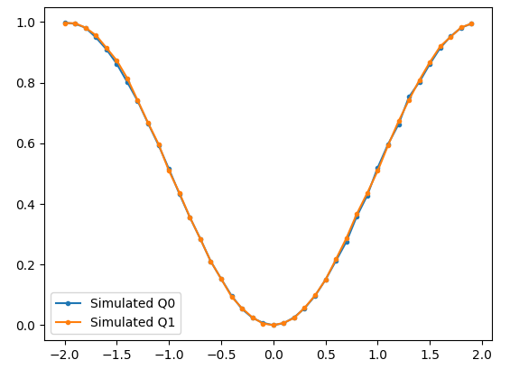

# Qua-Qsim
A quantum simulator for QUA programs.

## Installation
```sh
pip install git+http://github.com/qua-platform/qua-qsim.git
```

## Example: Power Rabi
Simulate simultaneous, two-qubit Rabi oscillations using an amplitude sweep on a
simulated backend.


### 1.1 Start with your QUA config
<details> 
  <summary>[example] config dictionary </summary>

```python

from qualang_tools.units import unit
u = unit(coerce_to_integer=True)

x90_q1_amp = 0.08
x90_q2_amp = 0.068

x90_len = 260 // 4

qubit_1_IF = 50 * u.MHz
qubit_1_LO = 4860000000 - qubit_1_IF

qubit_2_IF = 60 * u.MHz
qubit_2_LO = 4970000000 - qubit_2_IF

resonator_1_LO = 5.5 * u.GHz
resonator_1_IF = 60 * u.MHz

resonator_2_LO = 5.5 * u.GHz
resonator_2_IF = 60 * u.MHz

readout_len = 5000
readout_amp = 0.2

time_of_flight = 24

config = {
    "version": 1,
    "controllers": {
        "con1": {
            "analog_outputs": {
                1: {"offset": 0.0},  # I resonator 1
                2: {"offset": 0.0},  # Q resonator 1
                3: {"offset": 0.0},  # I resonator 2
                4: {"offset": 0.0},  # Q resonator 2
                5: {"offset": 0.0},  # I qubit 1
                6: {"offset": 0.0},  # Q qubit 1
                7: {"offset": 0.0},  # I qubit 2
                8: {"offset": 0.0},  # Q qubit 2
            },
            "digital_outputs": {},
            "analog_inputs": {
                1: {"offset": 0.0, "gain_db": 0},  # I from down-conversion
                2: {"offset": 0.0, "gain_db": 0},  # Q from down-conversion
            },
        },
    },
    "elements": {
        "qubit_1": {
            "RF_inputs": {"port": ("octave1", 3)},
            "intermediate_frequency": qubit_1_IF,
            "operations": {
                "x90": "x90_q1_pulse",
                "y90": "y90_q1_pulse",
            },
        },
        "qubit_1t2": {
            "RF_inputs": {"port": ("octave1", 3)},
            "intermediate_frequency": qubit_2_IF,
            "operations": {
                "x90": "x90_pulse",
            },
        },
        "qubit_2": {
            "RF_inputs": {"port": ("octave1", 4)},
            "intermediate_frequency": qubit_2_IF,
            "operations": {
                "x90": "x90_q2_pulse",
            },
        },
        "resonator_1": {
            "RF_inputs": {"port": ("octave1", 1)},
            "RF_outputs": {"port": ("octave1", 1)},
            "intermediate_frequency": resonator_1_IF,
            "operations": {
                "readout": "readout_pulse",
            },
            "time_of_flight": time_of_flight,
            "smearing": 0,
        },
        "resonator_2": {
            "RF_inputs": {"port": ("octave1", 2)},
            "RF_outputs": {"port": ("octave1", 1)},
            "intermediate_frequency": resonator_2_IF,
            "operations": {
                "readout": "readout_pulse",
            },
            "time_of_flight": time_of_flight,
            "smearing": 0,
        },
    },
    "octaves": {
        "octave1": {
            "RF_outputs": {
                1: {
                    "LO_frequency": resonator_1_LO,
                    "LO_source": "internal",
                    "output_mode": "always_on",
                    "gain": 0,
                },
                2: {
                    "LO_frequency": resonator_2_LO,
                    "LO_source": "internal",
                    "output_mode": "always_on",
                    "gain": 0,
                },
                3: {
                    "LO_frequency": qubit_1_LO,
                    "LO_source": "internal",
                    "output_mode": "always_on",
                    "gain": 0,
                },
                4: {
                    "LO_frequency": qubit_2_LO,
                    "LO_source": "internal",
                    "output_mode": "always_on",
                    "gain": 0,
                },
            },
            "RF_inputs": {
                1: {
                    "LO_frequency": resonator_1_LO,
                    "LO_source": "internal",
                },
            },
            "connectivity": "con1",
        }
    },
    "pulses": {
        "x90_q1_pulse": {
            "operation": "control",
            "length": x90_len,
            "waveforms": {
                "I": "x90_q1_I_wf",
                "Q": "x90_q1_Q_wf",
            },
        },
        "y90_q1_pulse": {
            "operation": "control",
            "length": x90_len,
            "waveforms": {
                "I": "y90_q1_I_wf",
                "Q": "y90_q1_Q_wf",
            },
        },
        "x90_q2_pulse": {
            "operation": "control",
            "length": x90_len,
            "waveforms": {
                "I": "x90_q2_I_wf",
                "Q": "x90_q2_Q_wf",
            },
        },
        "y90_q2_pulse": {
            "operation": "control",
            "length": x90_len,
            "waveforms": {
                "I": "y90_q2_I_wf",
                "Q": "y90_q2_Q_wf",
            },
        },
        "readout_pulse": {
            "operation": "measurement",
            "length": readout_len,
            "waveforms": {
                "I": "readout_wf",
                "Q": "zero_wf",
            },
            "integration_weights": {
                "cos": "cosine_weights",
                "sin": "sine_weights",
                "minus_sin": "minus_sine_weights",
            },
            "digital_marker": "ON",
        },
    },
    "waveforms": {
        "zero_wf": {"type": "constant", "sample": 0.0},
        # q1
        "x90_q1_I_wf": {"type": "constant", "sample": x90_q1_amp},
        "x90_q1_Q_wf": {"type": "constant", "sample": 0.},
        "y90_q1_I_wf": {"type": "constant", "sample": 0.},
        "y90_q1_Q_wf": {"type": "constant", "sample": x90_q1_amp},
        # q2
        "x90_q2_I_wf": {"type": "constant", "sample": x90_q2_amp},
        "x90_q2_Q_wf": {"type": "constant", "sample": 0.},
        "y90_q2_I_wf": {"type": "constant", "sample": 0.},
        "y90_q2_Q_wf": {"type": "constant", "sample": x90_q2_amp},
        "readout_wf": {"type": "constant", "sample": readout_amp},
    },
    "digital_waveforms": {
        "ON": {"samples": [(1, 0)]},
    },
}


```
</details>

### 1.2 Map your QUA elements to simulation channels
```python
from quaqsim.architectures.from_qua_channels import (
    TransmonPairBackendChannelReadout,
    TransmonPairBackendChannelIQ, 
    ChannelType
)

qubit_1_freq = 4860000000
qubit_2_freq = 4970000000.0

channel_map = {
    "qubit_1": TransmonPairBackendChannelIQ(
        qubit_index=0,
        carrier_frequency=qubit_1_freq,
        operator_i=transmon_pair.transmon_1_drive_operator(quadrature='I'),
        operator_q=transmon_pair.transmon_1_drive_operator(quadrature='Q'),
        type=ChannelType.DRIVE
    ),
    "qubit_1t2": TransmonPairBackendChannelIQ(
        qubit_index=0,
        carrier_frequency=qubit_2_freq,
        operator_i=transmon_pair.transmon_1_drive_operator(quadrature='I'),
        operator_q=transmon_pair.transmon_1_drive_operator(quadrature='Q'),
        type=ChannelType.CONTROL
    ),
    "qubit_2": TransmonPairBackendChannelIQ(
        qubit_index=1,
        carrier_frequency=qubit_2_freq,
        operator_i=transmon_pair.transmon_2_drive_operator(quadrature='I'),
        operator_q=transmon_pair.transmon_2_drive_operator(quadrature='Q'),
        type=ChannelType.DRIVE
    ),
    "resonator_1": TransmonPairBackendChannelReadout(0),
    "resonator_2": TransmonPairBackendChannelReadout(1),
}
```

### 2. Define your simulated quantum parameters
```python
from quaqsim.architectures.transmon_pair import TransmonPair
from quaqsim.architectures import TransmonSettings
from quaqsim.architectures.transmon_pair_settings import TransmonPairSettings

settings = TransmonPairSettings(
    TransmonSettings(
        resonant_frequency=4860000000.0,
        anharmonicity=-320000000.0,
        rabi_frequency=0.22e9
    ),
    TransmonSettings(
        resonant_frequency=4970000000.0,
        anharmonicity=-320000000.0,
        rabi_frequency=0.26e9
    ),
    coupling_strength=0.002e9
)

transmon_pair = TransmonPair(settings)
backend = TransmonPairBackendFromQUA(
    transmon_pair, 
    config_to_transmon_pair_backend_map
)

```

### 3. Define a QUA Program
```python
from qm.qua import *

start, stop, step = -2, 2, 0.1
with program() as prog:
    a = declare(fixed)

    with for_(a, start, a < stop - 0.0001, a + step):
        play("x90"*amp(a), "qubit_1")
        play("x90"*amp(a), "qubit_2")

        align("qubit_1", "qubit_2", "resonator_1", "resonator_2")
        measure("readout", "resonator_1", None)
        measure("readout", "resonator_2", None)

```

### 4. Simulate!
```python
import numpy as np
import matplotlib.pyplot as plt

from quaqsim import simulate_program

results = simulate_program(
    qua_program=prog,
    qua_config=config,
    qua_config_to_backend_map=channel_map,
    backend=transmon_pair_backend,
    num_shots=10_000,
)

for i, result in enumerate(results):
    plt.plot(np.arange(start, stop, step), results[i], '.-', label=f"Simulated Q{i}")
    plt.ylim(-0.05, 1.05)
plt.legend()
plt.show()
```
